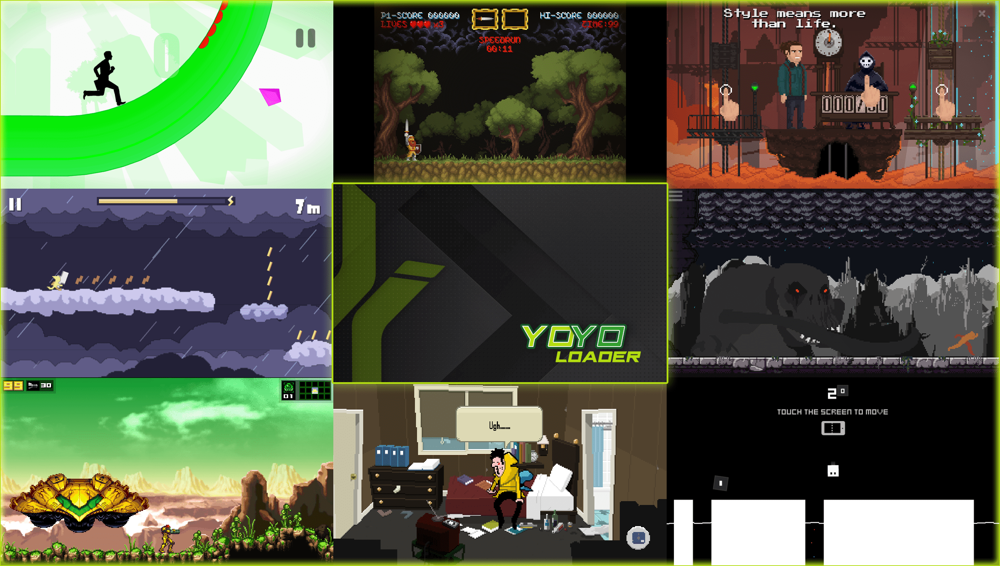

# YoYo Loader Vita

<p align="center"></p>

YoYo Loader is a loader for libyoyo.so, the official GameMaker Studio Runner application for Android, for the *PS Vita*.

YoYo Loader works by loading such ARMv7 executable in memory, resolving its imports with native functions and patching it in order to properly run.

By doing so, it's basically as if we emulate a minimalist Android environment in which we run natively the executable as is.

This enables to run potentially any game made with GameMaker Studio.

## What is supported

| Type of Game         | Compatibility                                                            |
| :------------------- |:------------------------------------------------------------------------ |
| Android Bytecode     |  `Native` |
| Android YYC          |  `Native` |
| PC/Console Bytecode  |  `Yes`    |
| PC/Console YYC       |  `No`     |

For PC/Console exported games, you will need to perform an assets swap with a blank Android exported project with a Game Maker Studio version similar or equal of the one of the game you want to attempt to run. You can find a small guide on how to perform an Asset Swap here: https://gist.github.com/CatoTheYounger97/fa47e7eef92f772e4004d4dac22f9bdb

Note that patches to the bytecode may still be required in order to fix resolution, inputs or performances issues. Any game reported as  `Native`, instead, will work with simple drag'n'drop of the apk.

A comprehensive Compatibility List can be found here: https://www.rinnegatamante.eu/yoyo/. You can contribute to it by opening an Issue here: https://github.com/Rinnegatamante/YoYo-Loader-Vita-Compatibility/issues.

If a game seems to be running out of memory, you can try to fix this issue by externalizing its assets with the related built-in function in the Game Selector. It is also possible to squeeze even more available mem by manually compressing externalized textures in PVRTC2 format (A guide can be found here: https://gist.github.com/CatoTheYounger97/ddc2dd4ec459212466ea6f9887bc764b ).

## Keyboard keys emulation

YoYo Loader supports mapping of physical buttons to keyboard keys for those games that have not working controller code. It may be especially useful for PC asset swapped games.

A guide on how to set it up can be found here: https://gist.github.com/CatoTheYounger97/ce19685d349d913f9a2f097464453c97

## Setup Instructions (For End Users)

In order to properly install the loader, you'll have to follow these steps precisely:

- Install [kubridge](https://github.com/TheOfficialFloW/kubridge/releases/) and [FdFix](https://github.com/TheOfficialFloW/FdFix/releases/) by copying `kubridge.skprx` and `fd_fix.skprx` to your taiHEN plugins folder (usually `ux0:tai`) and adding two entries to your `config.txt` under `*KERNEL`:
  
```
  *KERNEL
  ux0:tai/kubridge.skprx
  ux0:tai/fd_fix.skprx
```

**Note** Don't install fd_fix.skprx if you're using rePatch plugin

- Install `libshacccg.suprx`, if you don't have it already, by following [this guide](https://samilops2.gitbook.io/vita-troubleshooting-guide/shader-compiler/extract-libshacccg.suprx).
- Games must be placed inside `ux0:data/gms/GAMENAME`, where `GAMENAME` must refer to the name of the game, in form of an apk file renamed as `game.apk`. [You can get all the required files directly from your phone](https://stackoverflow.com/questions/11012976/how-do-i-get-the-apk-of-an-installed-app-without-root-access).
- Inside the loader, you can also find a feature, by pressing Triangle in the game selector screen, to optimize the apk. Such feature will optimize compression of the files inside the apk to not cause stuttering and loading issues and will also remove any unnecessary file thus reducing the final apk size.

## Build Instructions (For Developers)

In order to build the loader, you'll need a [vitasdk](https://github.com/vitasdk) build fully compiled with softfp usage.  
You can find a precompiled version here: https://github.com/vitasdk/buildscripts/releases.
Additionally, you'll need some libraries normally included in vdpm compiled with softfp. You can get most of the required ones here: https://github.com/Rinnegatamante/vitasdk-packages-softfp/releases.
Finally, you'll need to recompile the few missing ones on your own:

- [openal-soft](https://github.com/Rinnegatamante/openal-soft/tree/vgl)

    ```bash
    cd build
    cmake -DCMAKE_TOOLCHAIN_FILE=${VITASDK}/share/vita.toolchain.cmake -DCMAKE_BUILD_TYPE=Release -DCMAKE_C_FLAGS=-mfloat-abi=softfp .. && make install
    ```

- [vitaGL](https://github.com/Rinnegatamante/vitaGL)

    ````bash
    make SOFTFP_ABI=1 NO_DEBUG=1 SHARED_RENDERTARGETS=1 HAVE_GLSL_SUPPORT=1 install
    ````

After all these requirements are met, you can compile the loader similarly to how the CI compiles it for nightly builds: https://github.com/Rinnegatamante/yoyoloader_vita/blob/main/.github/workflows/compilation.yml

## Credits

- TheFloW for the original .so loader.
- JohnnyonFlame for GMLoader used as reference for some implementations, for generic advices and for maintaining the Brazilian Portuguese translation.
- Once13One for the Livearea assets and the README showcase image.
- hatoving for the German translation.
- BetterWinds and SofyUchiha for the Spanish translation.
- gl33ntwine for the Russian and Ukrainian translations.
- Titi Clash for the Brazilian Portuguese translation.
- kuragehime for the Japanese and the Ryukyuan translations.
- ikzouo for the Simplified and Traditional Chinese translations.
- Grip-hearttin' for the Czech translation.
- CatoTheYounger for providing most of the banners used in the game selector and testing several new features of the loader.
- Everyone who contributed, tested and provided support over Vita Nuova Discord channel.
